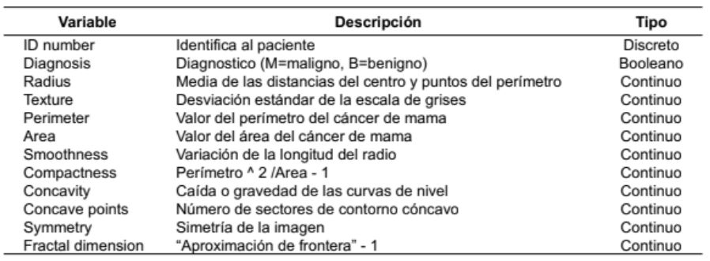

<h1 align="center"> Cluster Jerarquico VS Cluster Particional </h1>

## Introducción
El clustering es básicamente, encontrar grupos de objetos especificando algunas características, que pueden ser similitudes o relaciones entre grupos, además de diferencias de objetos de otros grupos. Estos datos pueden dividirse cuando tenemos información significativa o útil, donde debemos tomar en cuenta la captura de la estructura natural de los datos.
 
**Clustering jerárquico**
 
• El algoritmo de clustering jerárquico organiza los elementos, de manera 
recursiva, en una estructura en forma de árbol. Este árbol representa las 
relaciones de similitud entre los distintos elementos.
 
** Pasos para formar grupos (clústeres) **
 
• Son cuatro los pasos necesarios:
 
 
• 1. Utilizar un método para medir la similitud de los elementos.
 
• 2. Utilizar un método para agrupar a los elementos.
 
• 3. Utilizar un método para decidir la cantidad adecuada de grupos.
 
• 4. Interpretación de los grupos.
 
**Clúster Particional**  
El algoritmo particional, conocido también como de particiones, organiza los 
elementos dentro de k clústeres. Tiene ventajas en aplicaciones que involucran 
gran cantidad de datos.
 
# K-means
 
Es uno de los algoritmos utilizados en la industria para crear k clústeres a partir de 
un conjunto de elementos (objetos), de modo que los miembros de un grupo sean 
similares.
 
El algoritmo k-means resuelve problemas de optimización, dado que la función es 
minimizar (optimizar) la suma de las distancias de cada elemento al centroide de 
un clúster.
 
 ## Datos
 
Contexto
 
Estudios clínicos a partir de imágenes digitalizadas de pacientes con cáncer de 
mama de Wisconsin (WDBC, Wisconsin Diagnostic Breast Cancer)
 
 Fuente de datos:

  

## Conclusión 
